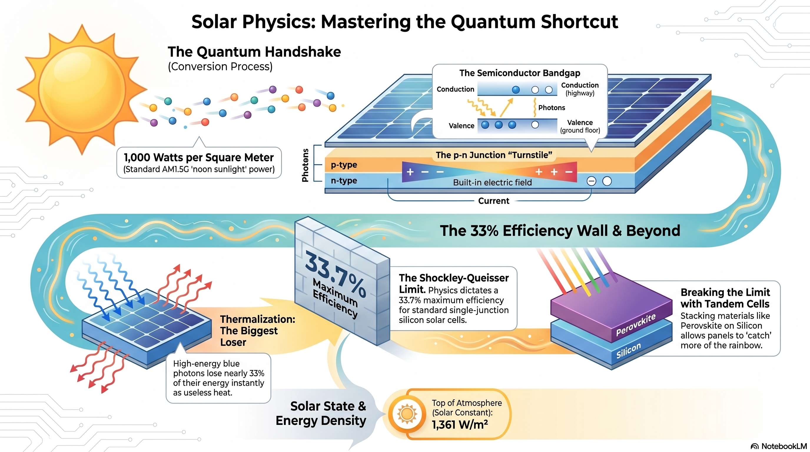

# 🔋 Renewable Energy and the Physics Behind It 🚀

**Author:** 👨‍🎓 Ahmed Dzemic, student of **GSSST Sarajevo**, Bosnia 🇧🇦



This project is a comprehensive multi-format academic and media package exploring the physical principles governing renewable energy, with a primary focus on photovoltaic systems. 💡

---

## 🛤️ Choose Your Reading Path

> This project has **two complete, parallel versions** of every chapter.  
> Pick the path that matches how you like to learn — or read both!

---

<table>
<tr>
<td width="50%" valign="top">

### 🎓 Path 1 — Technical Academic
**For:** Students, researchers, educators  
**Style:** Rigorous equations, concise explanations, academic depth

Perfect if you want the **full physics** with proper formulas and technical precision — the kind of writing you'd find in a university textbook.

**→ [Start with Chapter 1 (Academic)](sections/01_introduction.md)**

</td>
<td width="50%" valign="top">

### 🌱 Path 2 — Simplified & Explained
**For:** General readers, younger students, curious minds  
**Style:** Plain language, step-by-step reasoning, real-world analogies

Perfect if you want to truly **understand *why*** things work — every concept explained from first principles with examples, tables, and no assumed knowledge.

**→ [Start with Chapter 1 (Simplified)](sections_simplified/01_introduction.md)**

</td>
</tr>
</table>

---

## 📚 Full Table of Contents

This project offers **two parallel reading tracks** covering the same topics — choose the one that suits you best, or read both for the complete picture:

| Track | Audience | Style |
|---|---|---|
| 🎓 **Technical / Academic** | Students, researchers | Rigorous, formulas, concise |
| 🌱 **Simplified / Explained** | General readers, younger students | Plain language, analogies, rich detail |

---


### 🎓 Track 1 — Technical Academic Paper

> Rigorous physics with equations, concise explanations, and academic depth.

| # | Topic | Link |
|---|---|---|
| 1 | 🏗️ Introduction | [sections/01_introduction.md](sections/01_introduction.md) |
| 2 | 🌊 Overview of Renewable Energy Sources | [sections/02_overview_sources.md](sections/02_overview_sources.md) |
| 3 | ☀️ The Nature of Solar Radiation | [sections/03_nature_solar_radiation.md](sections/03_nature_solar_radiation.md) |
| 4 | 🔬 Fundamentals of Semiconductors | [sections/04_semiconductors.md](sections/04_semiconductors.md) |
| 5 | ⚡ The Photovoltaic Effect | [sections/05_photovoltaic_effect.md](sections/05_photovoltaic_effect.md) |
| 6 | 🧩 Structure of a Solar Cell | [sections/06_solar_cell_structure.md](sections/06_solar_cell_structure.md) |
| 7 | 📉 Efficiency and Loss Mechanisms | [sections/07_efficiency_losses.md](sections/07_efficiency_losses.md) |
| 8 | 💎 Advanced Solar Technologies | [sections/08_advanced_technologies.md](sections/08_advanced_technologies.md) |
| 9 | 🔋 Energy Storage and Grid Integration | [sections/09_storage_integration.md](sections/09_storage_integration.md) |
| 10 | 🌍 Environmental and Economic Impact | [sections/10_impact.md](sections/10_impact.md) |
| 11 | 🔮 Future Perspectives | [sections/11_future_perspectives.md](sections/11_future_perspectives.md) |
| 12 | 🏁 Conclusion | [sections/12_conclusion.md](sections/12_conclusion.md) |
| – | 📖 References | [sections/references.md](sections/references.md) |

---

### 🌱 Track 2 — Simplified & Explained

> The same content rewritten from scratch with plain language, step-by-step reasoning, real-world analogies, detailed tables, and much more explanatory depth — ideal if you are new to physics or want to truly understand *why* things work the way they do.

| # | Topic | Link |
|---|---|---|
| 1 | 🏗️ Why Does Our World Need New Energy? | [sections_simplified/01_introduction.md](sections_simplified/01_introduction.md) |
| 2 | 🌊 How Nature Gives Us Free Energy | [sections_simplified/02_overview_sources.md](sections_simplified/02_overview_sources.md) |
| 3 | ☀️ What Exactly Is Sunlight? | [sections_simplified/03_nature_solar_radiation.md](sections_simplified/03_nature_solar_radiation.md) |
| 4 | 🔬 Teaching Sand to Conduct Electricity | [sections_simplified/04_semiconductors.md](sections_simplified/04_semiconductors.md) |
| 5 | ⚡ Turning Light Into Electricity, Step by Step | [sections_simplified/05_photovoltaic_effect.md](sections_simplified/05_photovoltaic_effect.md) |
| 6 | 🧩 Anatomy of a Light-Eating Machine | [sections_simplified/06_solar_cell_structure.md](sections_simplified/06_solar_cell_structure.md) |
| 7 | 📉 Why Can't Solar Cells Do Better? | [sections_simplified/07_efficiency_losses.md](sections_simplified/07_efficiency_losses.md) |
| 8 | 💎 Breaking Physics' Own Rules | [sections_simplified/08_advanced_technologies.md](sections_simplified/08_advanced_technologies.md) |
| 9 | 🔋 Sunlight in a Bottle | [sections_simplified/09_storage_integration.md](sections_simplified/09_storage_integration.md) |
| 10 | 🌍 Why Physics Is Winning the Market | [sections_simplified/10_impact.md](sections_simplified/10_impact.md) |
| 11 | 🔮 The Next 100 Years of Harvest | [sections_simplified/11_future_perspectives.md](sections_simplified/11_future_perspectives.md) |
| 12 | 🏁 The Physical Reality of Hope | [sections_simplified/12_conclusion.md](sections_simplified/12_conclusion.md) |
| – | 📖 References & Further Reading | [sections_simplified/references.md](sections_simplified/references.md) |

---

### 🎙️ Podcast Series: "The Physics of Power"
- 📜 [**Full Podcast Script**](podcast/extended_narrative.md) - A 7-segment narrative deep dive into the energy revolution.
- 💡 [**Quick-Fire Talking Points**](podcast/talking_points.md) - Mind-blowing stats and high-impact facts for audio segments.

---

### 📊 Presentation Materials
- 🖥️ [**Slide Deck Source**](presentation/slides.md) - The foundation for the PowerPoint presentation.

---

## 📂 Project Structure

- `sections/`: 📝 Academic paper chapters — rigorous, equation-driven (Track 1).
- `sections_simplified/`: 🌱 Plain-language chapters with deep explanations and analogies (Track 2).
- `podcast/`: 🎧 Narrative script and high-signal talking points.
- `presentation/`: 📽️ Source material for generating PowerPoint slide decks.
- `assets/`: 🖼️ Folder for diagrams, graphs, and visual research materials.
- `metadata.yaml`: ⚙️ Configuration for Pandoc (Title, Author, Academic fonts).
- `Makefile`: 🛠️ Automation script for merging and converting all media formats.
- `build/`: 📦 Target directory for all generated outputs (.pdf, .docx, .pptx).

---

## 🛠️ Requirements

To build the project outputs, you need:

1. **Pandoc**: 🔄 [Installation Guide](https://pandoc.org/installing.html)
2. **XeLaTeX**: 🖋️ (Required for PDF conversion) Usually provided by MacTeX or TeX Live.
3. **Docker** 🐋 (Optional): Use the Pandoc Docker image if you prefer not to install tools locally.

---

## ⚙️ How to Build

Run the following commands in your terminal to generate the outputs in the `/build` folder:

```bash
# 🔨 Generate everything (PDF, Word, and PowerPoint)
make all

# 📝 Generate ONLY the MS Word paper
make paper-docx

# 📽️ Generate ONLY the PowerPoint presentation
make presentation

# 📄 Generate ONLY the PDF paper
make paper-pdf
```

---

## 📅 Current Project Status
- ✅ **Track 1 — Academic Content**: All 12 sections drafted with full technical physics depth.
- ✅ **Track 2 — Simplified Content**: All 12 sections rewritten in plain language with rich explanations.
- ✅ **Podcast Narrative**: Extended storytelling version completed.
- ✅ **Presentation Template**: Slide deck source created.
- 🏗️ **Visuals**: Descriptive figure placeholders in text; actual images should be placed in `assets/images/`.
- 🏗️ **Bibliography**: Initial credible references listed in both `sections/references.md` and `sections_simplified/references.md`.
